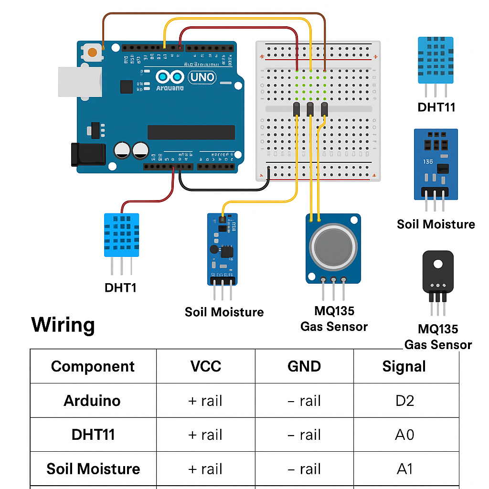

# 🍊 AgriVision – Smart Fruit Prediction System 🌱

**AgriVision** is a Python-based GUI project that predicts the best fruit to grow based on real-time environmental conditions using Arduino-connected sensors. It uses machine learning and IoT to assist farmers, researchers, and enthusiasts in smart crop decision-making.

---

## 🧠 Features

- 🌡️ Real-time data input via sensors (DHT11, MQ135, Soil Moisture)
- 🤖 ML-based prediction using trained `.pkl` model
- 🖼️ GUI shows fruit name, image, care info, and growing tips
- 🧪 Compatible with Arduino UNO for serial communication
- 🔧 Fully offline – no internet required to run

---

## 🧰 Hardware Components Required

| Component             | Quantity |
|------------------------|----------|
| Arduino UNO            | 1        |
| Breadboard             | 1        |
| DHT11 Sensor (Temp + Humidity) | 1 |
| Soil Moisture Sensor   | 1        |
| MQ135 Air Quality Sensor | 1      |
| Jumper Wires           | 10+      |
| USB Cable              | 1        |

---

## 🔌 Sensor Wiring & Arduino Setup

### ✅ Power Distribution
- Arduino **5V** → Breadboard **+ Rail**
- Arduino **GND** → Breadboard **– Rail**

### ✅ Sensor Wiring

| Sensor           | VCC         | GND         | Signal Pin on Arduino |
|------------------|-------------|-------------|------------------------|
| DHT11            | + rail      | – rail      | D2 (Digital)           |
| Soil Moisture    | + rail      | – rail      | A0 (Analog)            |
| MQ135            | + rail      | – rail      | A1 (Analog)            |

---

### 🧠 Circuit Diagram



---

## 🚀 Arduino Setup Instructions

### ✅ Step 1: Upload Code to Arduino

1. Open **Arduino IDE**
2. Connect your Arduino UNO via USB
3. Paste this code into the IDE:

```cpp
#include <DHT.h>

#define DHTPIN 2
#define DHTTYPE DHT11
DHT dht(DHTPIN, DHTTYPE);

const int soilPin = A0;
const int airPin = A1;

void setup() {
  Serial.begin(9600);
  dht.begin();
}

void loop() {
  float temp = dht.readTemperature();
  float hum = dht.readHumidity();
  int soil = analogRead(soilPin);
  int air = analogRead(airPin);

  if (isnan(temp) || isnan(hum)) {
    Serial.println("Error reading from DHT sensor");
    return;
  }

  Serial.print(temp); Serial.print(",");
  Serial.print(hum); Serial.print(",");
  Serial.print(soil); Serial.print(",");
  Serial.println(air);

  delay(2000); // Wait 2 seconds
}
````

---

### ✅ Step 2: Open Serial Monitor

* Click **Tools > Serial Monitor**
* Set baud rate to **9600**
* You should see output like:

```
25.00,65.00,490,300
```
```
This confirms that sensors are working.

---

## 🧑‍💻 Python Project Setup

### ✅ Step 3: Clone the Repository

```bash
git clone https://github.com/TechEnthusiastArmaan/AgriVision.git
cd AgriVision
```

---

### ✅ Step 4: Install Requirements

```bash
pip install -r requirements.txt
```

---

### ✅ Step 5: Set the Correct COM Port

In `main.py` or `sensor_reader.py`:

```python
arduino_port = "COM5"  # Replace with your Arduino COM port
```

---

### ✅ Step 6: Run the GUI App

```bash
python main.py
```

---

## 💻 What You’ll See in the GUI

* Welcome screen
* Input form (sensor values auto-filled or manual)
* Prediction result:

  * ✅ Fruit Name
  * 🔬 Scientific Name
  * 🌞 Sunlight Requirement
  * 🌡️ Ideal Temperature
  * 💧 Humidity Range
  * 📖 Growing Instructions
  * 🖼️ Image

---

## 🔁 Optional: Retrain Model

```bash
python train_model.py
```

Use this if you have a new dataset and want to improve or adjust the prediction model.

---

## 📷 Fruit Images

Save all fruit images inside:

```
resources/assets/
```

Use lowercase filenames like:

* `apple.png`
* `mousambi.png`
* `banana.png`
* `mango.png`

---

## ✅ Supported Fruits

* Apple
* Mango
* Guava
* Mousambi
* Banana
* Orange
* Pomegranate
* Kiwi
* Lemon
* Jamun
* Pear
* Cherries
* Strawberry
* Dragonfruit
* Grape
* Blueberry

---

## 🙌 Developed By

**Armaan Wadhwa**
B.Tech | Machine Learning Enthusiast
📍 India
🔗 [GitHub](https://github.com/TechEnthusiastArmaan)

---

## 📜 License

This project is open source and available under the [MIT License](LICENSE).

---